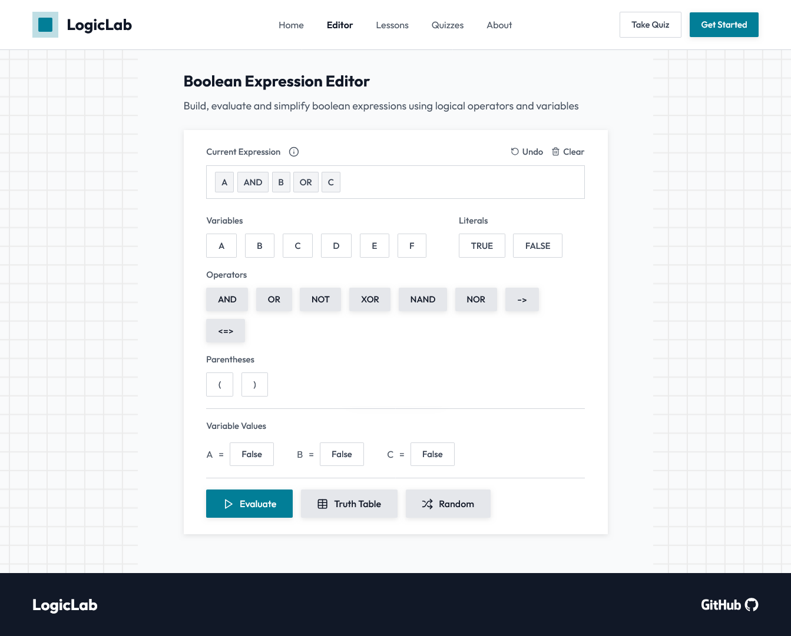

<h1 align="center">
    
</h1>

* [About](#-logic-lab)
* [Local Development](#local-development)
* [Tech Stack](#tech-stack)
* [Features](#features)
* [Showcase](#showcase)
* [License](#license)


# 🧩 Logic Lab

Logic Lab is a web application designed for building, testing, and learning Boolean Algebra. It provides interactive tools to construct and evaluate Boolean expressions, generate truth tables, and structured lessons with quizzes for comprehensive learning.

# Local Development

Requirements:
* Node.js
* npm

If you'd like to run the project locally, clone this repository to your local environment or download the project files:

```
git clone https://github.com/enzzoMs/LogicLab
```

Navigate to the main project directory:

```
cd ./LogicLab
```

Install the dependencies:

```
npm install
```

Start the development server and access the website through the url shown in the terminal:

```
npm run dev
```

# Tech Stack

* [TypeScript](https://www.typescriptlang.org/)

* [Astro](https://astro.build/) + [React](https://reactjs.org/)

* [Vite](https://vitejs.dev/)

* [Vitest](https://vitest.dev/)

Additional Libraries:
* [Lucide Icons](https://lucide.dev/)

# Features

- **Boolean Expression Builder**: Construct complex Boolean expressions using an intuitive interface.
- **Expression Evaluation**: Evaluate expressions for given set of inputs.
- **Truth Table Generator**: Automatically create truth tables for any boolean expression.
- **Lessons**: Lessons covering beginner to advanced topics.
- **Quizzes**: Multiple-choice quizzes for each lesson.

## Showcase

<p align="center">
    
</p>

# License

This project is distributed under the MIT License. See the [LICENSE](./LICENSE) file for more details.

